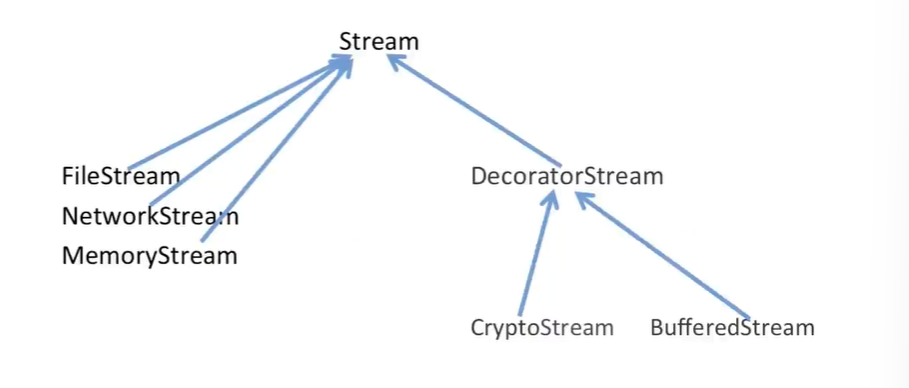

# Decorator装饰器模式

装饰模式属于单一职责模式，使用继承得到的结果往往随着需求的变化，子类急剧变化，同时充斥着大量重复代码。
这个时候关键就是划清责任。


## 1.动机
在面向对象编程中，有时需要为现有的类或对象添加新功能。这通常会面临两个主要问题：

- **1.继承的局限性**：虽然可以通过继承来扩展类的功能，但这会导致继承层次的膨胀。如果每次想要添加新功能都创建一个新的子类，代码将变得难以维护，继承关系也会越来越复杂。
- **2.修改现有代码的风险**：直接在现有类中添加新的方法或功能会破坏该类的封闭性和完整性，可能引入新的错误或导致不兼容。

假设现在有一个流类，同时又有文件流，网络流以及内存流，那么我们想对这些不同的流类进行加密以及缓存操作，如果我们使用继承的方式，那么就是以下这种样子：


对于这种拓展操作，会有大量的重复操作，我们可以用组合替代继承
可以把是原来的子类的方法，替换成父类，然后去new一个子类，这样就从编译时依赖变成了运行时依赖。


我们把原来继承的继承，改为了装饰和组合实现,装饰器模式通过一种更灵活的方式解决了这些问题，使得我们可以动态地为对象添加行为而不必修改其结构或增加复杂的继承层次。


## 2.解决方案
装饰器模式的主要思想是通过对象组合来动态地为对象添加行为。它通常包含以下几个部分：

1. **基类接口**：定义了对象所需实现的基本方法，所有的对象（包括装饰器）都要实现这个接口。

2. **具体类**：实现基类接口的具体对象，提供实际的功能或数据。

3. **装饰器类**：继承基类接口，同时持有一个对象的指针。装饰器类通过组合对象的方式，为现有对象添加新的行为或功能。

4. **具体装饰器**：是装饰器类的具体实现，继承装饰器类并添加新的行为或功能。

Decorator在接口上表现为is-a的继承关系，在实现上又有has-a组合关系
```cpp
class CryptoStream : public Stream {
    // 在这个继承类中，既有继承，又有组合，把装配时编译改成了运行时编译
    Stream* stream;
public:
    virtual char Read(){
        // 额外的加密操作
        stream->Read();
    }
    virtual void Seek() {
        // 额外的加密操作
        stream->Seek();
    }
    // ...
}
```

那么我们的使用方式如下：
```cpp
void fun() {
    FileStream* s1 = new FileStream();
    CryptoStream* s2 = new CryptoStream(s1); // 进行加密
    BufferedStream* s3 = new BufferedStream(s1); // 进行缓存
    BufferedStream* s4 = new BufferedStream(s2); // 既加密又缓存
}
```

在于解决主体类的多个方向的功能扩展问题，它是对原子类的扩展操作，而不是继承操作。


将编译时扩展修改为运行时动态扩展对象功能的能力，避免了使用继承带来的“灵活性差”和“多子类衍生”。

**装饰器模式一个非常独特的特点**：父类和成员都是同一个

主要是解决主体类的多个方向的功能扩展的问题，抽象基类和装饰器都是稳定的部分，而具体的实现是不稳定的部分，可以进行扩展！组合优于继承的经典体现，找到稳定的部分和变化的部分



## 3.应用场景
装饰器模式在实际开发中有广泛的应用场景，包括但不限于以下：

1. **增强现有功能**：例如在饮品销售系统中为咖啡添加配料（如牛奶、糖）或在图形处理系统中为图形对象添加新属性。

2. **日志记录**：可以通过装饰器为函数或方法添加日志记录功能，而不需要修改其原有逻辑。

3. **缓存**：为数据查询函数或 API 请求函数添加缓存功能，以提高性能。

4. **权限管理**：可以通过装饰器为特定方法或接口添加权限检查功能，确保只有授权用户才能访问。

5. **动态特性**：例如在编程语言解释器或编译器中，通过装饰器为函数添加新的语法或特性。

总之，装饰器模式提供了一种灵活且可扩展的方式，在不修改现有代码的前提下为对象添加新的行为或功能。这使得它在软件开发中具有广泛的应用价值。

## 4.示例代码
我在这里提供了一个饮品的销售系统，分别是用继承方法实现与用装饰器方法实现，我们可以查看一下他们的差异：

未优化：
```cpp
#include <iostream>
#include <string>
#include <memory>

using namespace std;

// 基本的饮品抽象类
class IBeverage {
public:
    virtual string getDescription() const = 0; // 描述
    virtual double cost() const = 0; // 价格
    virtual ~IBeverage() {}
};

// 具体的饮品类： 卡布奇诺
class Cappuccino : public IBeverage {
public:
    string getDescription() const override {
        return "Cappuccino";
    }

    double cost() const override {
        return 10.0;
    }
};

// 具体的饮品类： 可口可乐
class CocaCola : public IBeverage {
public:
    string getDescription() const override {
        return "CocaCola";
    }

    double cost() const override {
        return 5.0;
    }
};


// 给卡布奇诺通过继承的方式添加牛奶
class Milk : public Cappuccino {
public:
    string getDescription() const override {
        return Cappuccino::getDescription() + " with Milk";
    }

    double cost() const override {
        return Cappuccino::cost() + 2.0;
    }

    void addMilk() {
        cout << "Add Milk" << endl;
    }
};

// 给卡布奇诺通过继承的方式添加冰块
class Ice : public Cappuccino {
public:
    string getDescription() const override {
        return Cappuccino::getDescription() + " with Ice";
    }

    double cost() const override {
        return Cappuccino::cost() + 1.0;
    }

    void addIce() {
        cout << "Add Ice" << endl;
    }
};

// 给可口可乐通过继承的方式添加冰块
class IceCocaCola : public CocaCola {
public:
    string getDescription() const override {
        return CocaCola::getDescription() + " with Ice";
    }

    double cost() const override {
        return CocaCola::cost() + 1.0;
    }

    void addIce() {
        cout << "Add Ice" << endl;
    }
};

// 给可口可乐通过继承的方式添加柠檬
class LemonCocaCola : public CocaCola {
public:
    string getDescription() const override {
        return CocaCola::getDescription() + " with Lemon";
    }

    double cost() const override {
        return CocaCola::cost() + 2.0;
    }

    void addLemon() {
        cout << "Add Lemon" << endl;
    }
};


int main() {
    /*首先，我们来一杯卡布奇诺*/ 
    unique_ptr<IBeverage> cappuccino = make_unique<Cappuccino>();
    // 然后，我们给卡布奇诺加牛奶
    unique_ptr<Milk> milk = make_unique<Milk>();
    cout << milk->getDescription() << " : " << milk->cost() << endl;
    milk->addMilk();
    // 接着，我们给卡布奇诺加冰块
    unique_ptr<Ice> ice = make_unique<Ice>();
    cout << ice->getDescription() << " : " << ice->cost() << endl;
    ice->addIce();


    /* 再来一杯可口可乐 */ 
    unique_ptr<CocaCola> cocaCola = make_unique<CocaCola>();
    // 然后，我们给可口可乐加冰块
    unique_ptr<IceCocaCola> iceCocaCola = make_unique<IceCocaCola>();
    cout << iceCocaCola->getDescription() << " : " << iceCocaCola->cost() << endl;
    iceCocaCola->addIce();
    // 最后，我们给可口可乐加柠檬
    unique_ptr<LemonCocaCola> lemonCocaCola = make_unique<LemonCocaCola>();
    cout << lemonCocaCola->getDescription() << " : " << lemonCocaCola->cost() << endl;
    lemonCocaCola->addLemon();

    return 0;
}
```

优化之后
```cpp
#include <iostream>
#include <string>
#include <memory>

using namespace std;

// 基本的饮品抽象类
class IBeverage {
public:
    virtual string getDescription() const = 0; // 描述
    virtual double cost() const = 0; // 价格
    virtual ~IBeverage() {}
};

// 具体的饮品类： 卡布奇诺
class Cappuccino : public IBeverage {
public:
    string getDescription() const override {
        return "Cappuccino";
    }

    double cost() const override {
        return 10.0;
    }
};

// 具体的饮品类： 可口可乐
class CocaCola : public IBeverage {
public:
    string getDescription() const override {
        return "CocaCola";
    }

    double cost() const override {
        return 5.0;
    }
};

// 装饰者基类
class BeverageDecorator : public IBeverage {
    // 把公共的方法放在基类中，避免在每个具体装饰者中重复实现
    // 既有继承又有组合
protected:
    shared_ptr<IBeverage> beverage; // 持有一个饮品对象的指针
public:
    BeverageDecorator(shared_ptr<IBeverage> b) : beverage(b) {}
    string getDescription() const override {
        return beverage->getDescription();
    }
    double cost() const override {
        return beverage->cost();
    }
    virtual ~BeverageDecorator() {}
    virtual void addSomething() = 0;
};

// 具体的装饰者类： 牛奶
class Milk : public BeverageDecorator {
public:
    Milk(shared_ptr<IBeverage> b) : BeverageDecorator(b) {}
    string getDescription() const override {
        return beverage->getDescription() + " with Milk";
    }
    double cost() const override {
        return beverage->cost() + 2.0;
    }
    virtual void addSomething() {
        cout << "Add Milk" << endl;
    }
};

// 具体的装饰者类： 冰块
class Ice : public BeverageDecorator {
public:
    Ice(shared_ptr<IBeverage> b) : BeverageDecorator(b) {}
    string getDescription() const override {
        return beverage->getDescription() + " with Ice";
    }
    double cost() const override {
        return beverage->cost() + 1.0;
    }
    virtual void addSomething() {
        cout << "Add Ice" << endl;
    }
};


// 具体的装饰者类： 柠檬
class Lemon : public BeverageDecorator {
public:
    Lemon(shared_ptr<IBeverage> b) : BeverageDecorator(b) {}
    string getDescription() const override {
        return beverage->getDescription() + " with Lemon";
    }
    double cost() const override {
        return beverage->cost() + 3.0;
    }
    virtual void addSomething() {
        cout << "Add Lemon" << endl;
    }
};

int main() {
    /*首先，我们来一杯卡布奇诺*/ 
    shared_ptr<IBeverage> cappuccino = make_shared<Cappuccino>();
    // 为卡布奇诺加一些牛奶
    cappuccino = make_shared<Milk>(cappuccino);
    dynamic_cast<Milk*>(cappuccino.get())->addSomething();
    cout << cappuccino->getDescription() << " : " << cappuccino->cost() << endl;
    
    // 为卡布奇诺加一些冰块
    cappuccino = make_shared<Ice>(cappuccino);
    dynamic_cast<Ice*>(cappuccino.get())->addSomething();
    cout << cappuccino->getDescription() << " : " << cappuccino->cost() << endl;


    /* 再来一杯可口可乐 */
    cout << "======================" << endl;
    shared_ptr<IBeverage> cocaCola = make_shared<CocaCola>();
    // 为可口可乐加一些冰块
    cocaCola = make_shared<Ice>(cocaCola);
    dynamic_cast<Ice*>(cocaCola.get())->addSomething();
    cout << cocaCola->getDescription() << " : " << cocaCola->cost() << endl;

    // 为可口可乐加一些柠檬
    cocaCola = make_shared<Lemon>(cocaCola);
    dynamic_cast<Lemon*>(cocaCola.get())->addSomething();
    cout << cocaCola->getDescription() << " : " << cocaCola->cost() << endl;

    return 0;
}
```