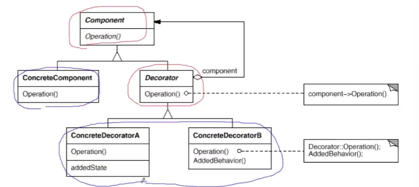
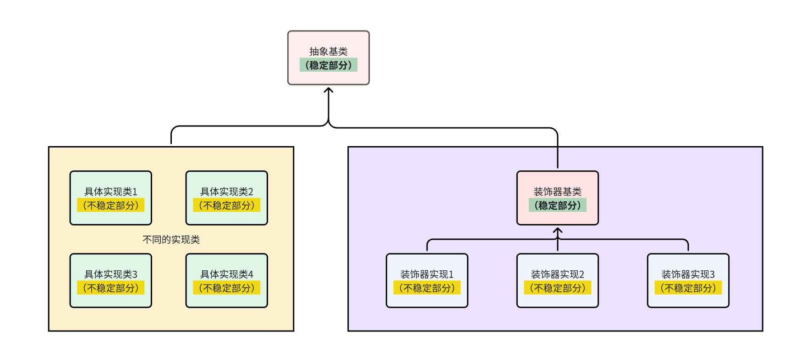

# Decorator装饰器模式

装饰模式属于单一职责模式，使用继承得到的结果往往随着需求的变化，子类急剧变化，同时充斥着大量重复代码。
这个时候关键就是划清责任。

## 动机
针对很多子类，我们希望对所有的子类都进行统一的操作

对于这种拓展操作，会有大量的重复操作，我们可以用组合替代继承
可以把是原来的子类的方法，替换成父类，然后去new一个子类，这样就从编译时依赖变成了运行时依赖。

我们把原来继承的继承，改为了装饰和组合实现

Decorator在接口上表现为is-a的继承关系，在实现上又有has-a组合关系

在于解决主体类的多个方向的功能扩展问题，它是对原子类的扩展操作，而不是继承操作。

