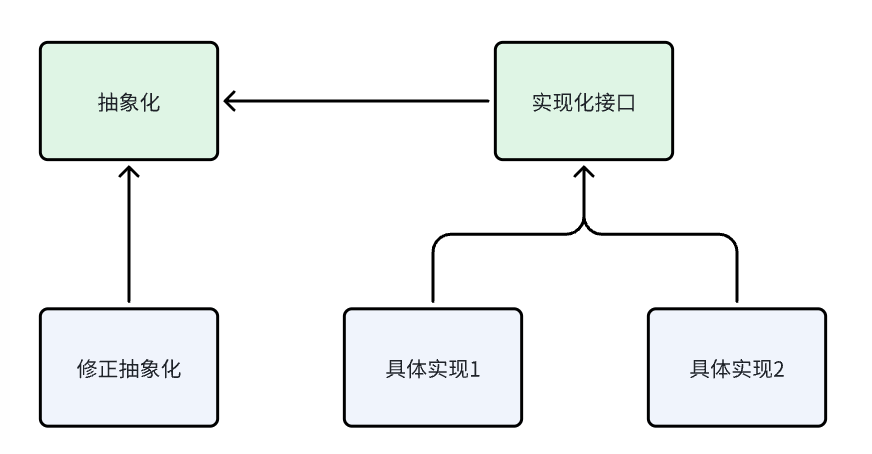

# Bridge 桥模式

## 1. 动机
由于某些类型的固有实现逻辑，使得他们具有两个乃至多个维度的变化。如何应对这种多维度的变化，但是又不增加额外的复杂度，需要进行设计。

桥模式可以将抽象化与实现化解耦，使得二者独立地变化，通过组合的方式进行不同的实现，达到更好的扩展和灵活性。


## 2. 解决方案
桥接模式通过定义一个抽象类持有一个实现类的接口的引用，抽象类提供基本操作，而具体的实现交给实现类接口。这样，抽象类和实现类可以独立扩展，不会相互影响，实现了解耦。

桥模式有以下几个板块：
- 抽象化角色：定义抽象化给出的接口
- 修正抽象化角色：扩展抽象化角色，改变和修正父类对于抽象化的定义
- 实现化角色：给出实现化角色的接口，但是不给出具体实现
- 具体实现角色：给出具体实现

## 3.应用场景
假设现在有一个消息发送系统，需要处理不同的类型消息，并且通过不同的方式发送，那么我们可以先定义消息的抽象和实现：
```cpp
// 消息发送器接口
class MessageSender{
public:
    virtual ~MessageSender(){}
    virtual void send(const string& content=0);
};

// 通过电子邮件发送
class Email : public MessageSender {
public:
    void send(const string& content) override {
        cout << "Sending email..." << endl;
    }
};
// 通过短信发送
class Sms : public MessageSender {
public:
    void send(const string& content) override {
        cout << "Sending sms..." << endl;
    }
};
```

接下来再定义抽象的消息类和它的两个派生类
```cpp
// 抽象消息类
class Message {
protected:
    MessageSender* sender;
public:
    Message(MessageSender* sender) : sender(sender) {}
    virtual ~Message() {}
    virtual void send(const std::string& content) = 0;
};

// 普通消息
class NormalMessage : public Message {
public:
    NormalMessage(MessageSender* sender) : Message(sender) {}
    void send(const std::string& content) override {
        std::cout << "NormalMessage: ";
        sender->sendMessage(content);
    }
};

// 紧急消息
class UrgentMessage : public Message {
public:
    UrgentMessage(MessageSender* sender) : Message(sender) {}
    void send(const std::string& content) override {
        std::cout << "UrgentMessage: ";
        sender->sendMessage(content + " [urgent]");
    }
};
```


最后我们对这个设计进行测试：
```cpp
int main() {
    EmailS email;
    Sms sms;

    // 创建一个通过电子邮件发送普通消息的实例
    NormalMessage normalMsg(&email);
    normalMsg.send("Hello, this is a normal message.");

    // 创建一个通过短信发送紧急消息的实例
    UrgentMessage urgentMsg(&sms);
    urgentMsg.send("Please respond ASAP!");

    return 0;
}
```


